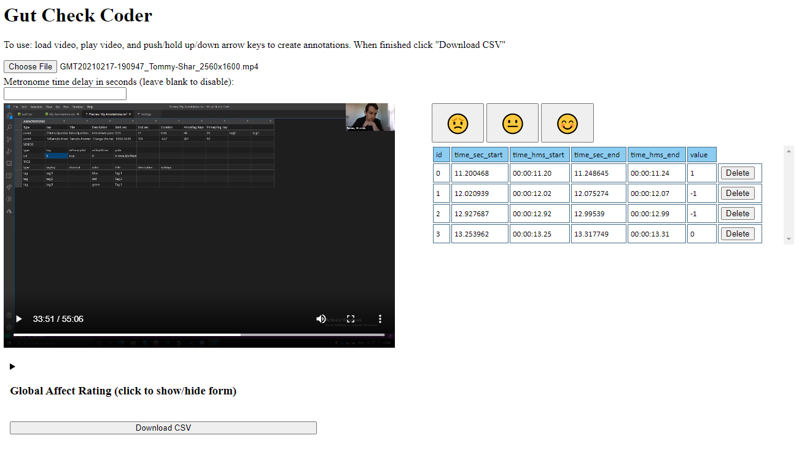

# Gut Check Coder

The Gut Check Coder is a tool for quick affective evaluation and coding of multimedia data. Inspired by [RIAS](https://pubmed.ncbi.nlm.nih.gov/11932123/), you can load in a video or audio file (tested on Chromium, which supports .mp4, .mov, .mpeg4, .ogg, .webm, and .wav) and then code positive, negative, and neutral affect moments in a time-aligned manner.

To use:
- Load a media file
- Play the media file (coding can not happen while the media is paused or unloaded)
- Either click on the face buttons or use the arrows keys to code (UP-positive, DOWN-negative, RIGHT-neutral)

When finished you can export data as a CSV file.

Optionally you can use the Global Affect Rating form to input additional details and notes.

In the event of coding errors, you can delete entries from the annotation table on the right side of the screen.

You can also scrub the media to specific moments by clicking on any of the annotation time values in the annotation table.
